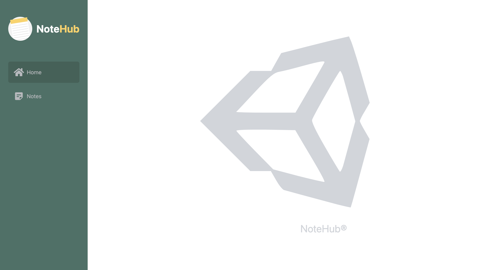
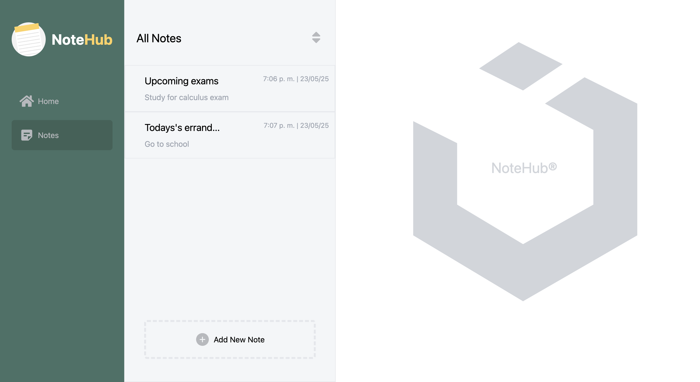
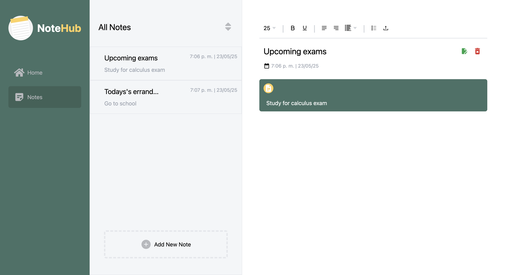
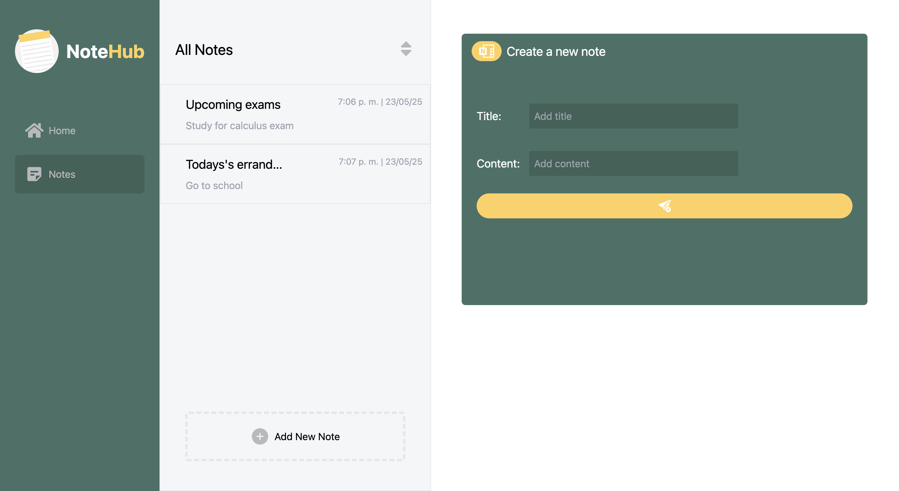

## NoteHub

NoteHub is a feature-rich note-taking web application that provides users with a seamless experience to create, delete, and edit personal notes. It offers a reliable and secure note-taking experience by leveraging .NET 7 and C# for backend functionality and data management. The frontend is designed with Next.js, Tailwind CSS, and TypeScript, resulting in a visually appealing and user-friendly interface.

## Technologies Used
### - Next.js
### - .NET 7
### - TypeScript
### - Tailwind CSS
### - C#
### - SQL Server
  
  
## Features
### - Create new notes with ease.
### - Edit and delete existing notes to update content.
### - Backend functionality implemented with .NET 7 and C#.
### - Reliable and secure note storage with SQL Server.

## Home

## Notes

## Single Note

## Add Note

  
 
## Contributing
If you would like to contribute to this app, please create a pull request.

